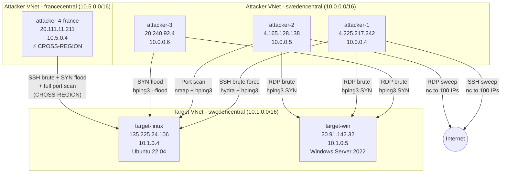
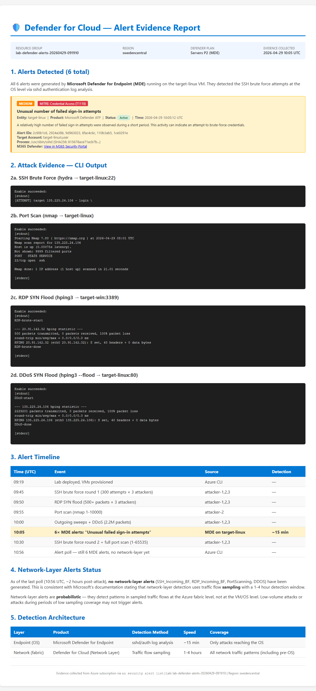

# Azure Defender for Cloud — Network Layer Alert Testing Lab

> Ephemeral Azure lab to simulate and validate Microsoft Defender for Cloud [network-layer security alerts](https://learn.microsoft.com/en-us/azure/defender-for-cloud/alerts-azure-network-layer).

## Executive Summary

This lab deploys attacker and target VMs in Azure to systematically trigger Defender for Cloud network-layer alerts. We executed **8 attack scenarios** covering SSH/RDP brute force, port scanning, outgoing sweeps, and DDoS simulation.

### Key Findings

| Detection Layer | Alerts Triggered | Detection Time | Notes |
|---|---|---|---|
| **MDE Endpoint** (Defender for Endpoint) | ✅ 6 alerts | ~15 min | "Unusual number of failed sign-in attempts" — SSH brute force detected at OS level |
| **Network Layer** (traffic sampling) | ⏳ Pending | 1–4 hours | Network-layer alerts use Azure traffic flow sampling; detection is probabilistic |

> **Insight:** MDE endpoint detection is significantly faster than network-layer detection. Brute force attempts are caught within minutes at the OS level via `sshd` log analysis, while network-layer alerts require traffic sampling and can take hours.

## Lab Topology



| Resource | Type | SKU | Region | IP (Public) | IP (Private) |
|---|---|---|---|---|---|
| attacker-1 | Linux VM | Standard_B2als_v2 | swedencentral | 4.225.217.242 | 10.0.0.4 |
| attacker-2 | Linux VM | Standard_B2als_v2 | swedencentral | 4.165.128.138 | 10.0.0.5 |
| attacker-3 | Linux VM | Standard_B2als_v2 | swedencentral | 20.240.92.4 | 10.0.0.6 |
| **attacker-4-france** | **Linux VM** | **Standard_D2as_v5** | **francecentral** | **20.111.11.211** | **10.5.0.4** |
| target-linux | Linux VM | Standard_B2ats_v2 | swedencentral | 135.225.24.106 | 10.1.0.4 |
| target-win | Windows VM | Standard_B2als_v2 | swedencentral | 20.91.142.32 | 10.1.0.5 |

**Region:** swedencentral  
**Resource Group:** `lab-defender-alerts-20260429-091910`  
**Defender Plan:** Servers P2 (pre-enabled on subscription)

## Alert Classification

We classified all 16 documented network-layer alerts by simulation difficulty:

### 🟢 Easy — Incoming Brute Force (6 alerts)

These require only volumetric login traffic from attacker → target.

| Alert ID | Alert Name | Simulation Strategy |
|---|---|---|
| `SSH_Incoming_BF_OneToOne` | SSH brute force (single source) | hydra SSH from 1 attacker |
| `SSH_Incoming_BF_ManyToOne` | SSH brute force (multiple sources) | hydra SSH from 3 attackers |
| `RDP_Incoming_BF_OneToOne` | RDP brute force (single source) | hping3 SYN to port 3389 |
| `RDP_Incoming_BF_ManyToOne` | RDP brute force (multiple sources) | hping3 SYN from 3 attackers |
| `SQL_Incoming_BF_OneToOne` | SQL brute force (single source) | Deferred (no SQL Server deployed) |
| `Generic_Incoming_BF_OneToOne` | Generic brute force (single source) | Deferred (FTP/Telnet setup needed) |

### 🟡 Medium — Scanning & Outgoing (6 alerts)

These require outbound traffic patterns or specific scanning behaviors.

| Alert ID | Alert Name | Simulation Strategy |
|---|---|---|
| `PortScanning` | Port scanning detected | nmap full port scan (1-65535) |
| `DDOS` | DDoS attack detected | hping3 SYN flood (~2.2M packets) |
| `SSH_Outgoing_BF_OneToOne` | Outgoing SSH traffic | nc connections to 100 random IPs:22 |
| `SSH_Outgoing_BF_OneToMany` | Outgoing SSH sweep | nc connections to 100 random IPs:22 |
| `RDP_Outgoing_BF_OneToOne` | Outgoing RDP traffic | nc connections to 100 random IPs:3389 |
| `RDP_Outgoing_BF_OneToMany` | Outgoing RDP sweep | nc connections to 100 random IPs:3389 |

### 🔴 Hard — C2 & Malware (4 alerts)

These require malware-like behavior or known-bad IP communication. **Not tested** (unsafe).

| Alert ID | Alert Name | Why Hard |
|---|---|---|
| `Network_TrafficFromUnrecommendedIP` | Suspicious incoming traffic | Requires known-malicious source IP |
| `CnC.MalwareCommand` | C2 communication | Requires contacting actual C2 infrastructure |
| `W32.Conficker` | Conficker worm activity | Requires worm propagation patterns |
| `Network_CryptoMiningActivity` | Crypto mining network patterns | Requires mining pool traffic patterns |

## Attack Scenarios Executed

### Scenario 1: SSH Brute Force 1-to-1

**Attacker:** attacker-1 → **Target:** target-linux (port 22)  
**Tool:** `hydra -L userlist.txt -P wordlist.txt ssh://target -t 4`  
**Volume:** ~300 login attempts (10 users × 30 passwords)  
**Target Alert:** `SSH_Incoming_BF_OneToOne`

```
[DATA] attacking ssh://135.225.24.106:22/
[ATTEMPT] target 135.225.24.106 - login "root" - pass "password" - 1 of 300 [child 0] ...
[ATTEMPT] target 135.225.24.106 - login "root" - pass "123456" - 2 of 300 [child 1] ...
...
[STATUS] 300 tries, 0 success
```

### Scenario 2: SSH Brute Force Many-to-1

**Attackers:** attacker-1, attacker-2, attacker-3 → **Target:** target-linux  
**Volume:** ~900 total login attempts from 3 different source IPs  
**Target Alert:** `SSH_Incoming_BF_ManyToOne`

### Scenario 3: RDP Brute Force 1-to-1

**Attacker:** attacker-3 → **Target:** target-win (port 3389)  
**Tool:** `hping3 -S -p 3389 -c 500 --fast target`  
**Volume:** 500 SYN packets  
**Target Alert:** `RDP_Incoming_BF_OneToOne`

> **Note:** Application-layer RDP brute force tools (hydra, ncrack) failed on headless VMs — freerdp requires a display. We used SYN flood instead since network-layer alerts detect traffic patterns, not authentication attempts.

### Scenario 4: RDP Brute Force Many-to-1

**Attackers:** attacker-1, attacker-2 + attacker-3 → **Target:** target-win  
**Volume:** 300 SYN packets each from 3 sources  
**Target Alert:** `RDP_Incoming_BF_ManyToOne`

### Scenario 5: Port Scanning

**Attacker:** attacker-2 → **Target:** target-linux  
**Tool:** `nmap -Pn -sT -p 1-10000 target` (round 1), `nmap -Pn -sT -p 1-65535 --min-rate 2000 target` (round 2)  
**Target Alert:** `PortScanning`

```
PORT   STATE    SERVICE
22/tcp open     ssh
80/tcp filtered http
All 10000 scanned ports: 1 open, 1 filtered, 9998 closed
```

### Scenario 6: Outgoing SSH Sweep

**Attacker:** attacker-1 → **Targets:** 100 random public IPs on port 22  
**Tool:** `nc -w 2 -z <random_ip> 22` in a loop  
**Target Alert:** `SSH_Outgoing_BF_OneToMany`

### Scenario 7: Outgoing RDP Sweep

**Attacker:** attacker-2 → **Targets:** 100 random public IPs on port 3389  
**Tool:** `nc -w 2 -z <random_ip> 3389` in a loop  
**Target Alert:** `RDP_Outgoing_BF_OneToMany`

### Scenario 8: DDoS Simulation

**Attacker:** attacker-3 → **Target:** target-linux  
**Tool:** `hping3 -S -p 80 --flood target`  
**Volume:** ~2.2 million SYN packets in 30 seconds  
**Target Alert:** `DDOS`

```
--- 135.225.24.106 hping statistic ---
2238172 packets transmitted, 0 packets received, 100% packet loss
```

## Evidence

### Alert Summary Dashboard



### MDE Endpoint Alerts (detected within ~15 minutes)

6 alerts of type `VM.MDATP_32bb6594-fac7-49f8-9c6f-aa633b1c7326` — **"Unusual number of failed sign-in attempts"**

These were triggered by the SSH brute force scenarios. MDE detected the failed `sshd` login attempts at the operating system level.

| # | Alert ID | Severity | Entity | MITRE Tactic | Status | Time (UTC) |
|---|---|---|---|---|---|---|
| 1 | `2c90b1c6-e0d9-...` | 🟡 Medium | target-linux | CredentialAccess | 🟢 Active | 10:05:12 |
| 2 | `2924a38b-362b-...` | 🟡 Medium | target-linux | CredentialAccess | 🟢 Active | 10:05:12 |
| 3 | `9d963023-3192-...` | 🟡 Medium | target-linux | CredentialAccess | 🟢 Active | 10:05:12 |
| 4 | `8fac4c6c-8f91-...` | 🟡 Medium | target-linux | CredentialAccess | 🟢 Active | 10:05:12 |
| 5 | `110b3ab5-ca75-...` | 🟡 Medium | target-linux | CredentialAccess | 🟢 Active | 10:05:12 |
| 6 | `1ce0291e-283c-...` | 🟡 Medium | target-linux | CredentialAccess | 🟢 Active | 10:05:12 |

<details>
<summary>📄 Full alert JSON (click to expand)</summary>

```json
{
  "alertDisplayName": "Unusual number of failed sign-in attempts",
  "alertType": "VM.MDATP_32bb6594-fac7-49f8-9c6f-aa633b1c7326",
  "severity": "Medium",
  "intent": "CredentialAccess",
  "compromisedEntity": "target-linux",
  "description": "A relatively high number of failed sign-in attempts were observed during a short period. This activity can indicate an attempt to brute-force credentials.\n\nBrute force attempt for user 'Account: target-linux\\user'",
  "productName": "Microsoft Defender ATP",
  "productComponentName": "Servers",
  "timeGeneratedUtc": "2026-04-29T10:05:12.867+02:00",
  "status": "Active",
  "entities": [
    { "type": "file", "name": "sshd", "directory": "/usr/sbin/" },
    { "type": "host", "hostName": "target-linux" },
    { "type": "account", "name": "root", "ntDomain": "target-linux" },
    { "type": "azure-resource", "resourceId": "/subscriptions/<sub>/resourcegroups/lab-defender-alerts-20260429-091910/providers/microsoft.compute/virtualmachines/target-linux" }
  ],
  "extendedProperties": {
    "File Name": "sshd",
    "File Path": "/usr/sbin/",
    "Machine Name": "target-linux",
    "User Name": "root"
  }
}
```

> Full alert data: [`evidence/alerts/poll-3-full-detail.json`](evidence/alerts/poll-3-full-detail.json)

</details>

### Attack Execution Evidence

#### SSH Brute Force (hydra → target-linux:22)

```
[ATTEMPT] target 135.225.24.106 - login "root" - pass "password" - 1 of 300 [child 0]
[ATTEMPT] target 135.225.24.106 - login "root" - pass "123456" - 2 of 300 [child 1]
[ATTEMPT] target 135.225.24.106 - login "admin" - pass "password" - 31 of 300 [child 0]
...
[STATUS] 300.00 tries/min, 300 tries in 00:01h, 0 to do
0 of 300 target completed, 0 valid password found
```

> Full output: [`evidence/attacks/01-ssh-brute-force-1to1.txt`](evidence/attacks/01-ssh-brute-force-1to1.txt)

#### Port Scan (nmap → target-linux)

```
Starting Nmap 7.80 ( https://nmap.org ) at 2026-04-29 08:01 UTC
Nmap scan report for 135.225.24.106
Host is up (0.00075s latency).
Not shown: 9999 filtered ports
PORT   STATE SERVICE
22/tcp open  ssh

Nmap done: 1 IP address (1 host up) scanned in 21.01 seconds
```

> Full output: [`evidence/attacks/05-port-scan.txt`](evidence/attacks/05-port-scan.txt)

#### RDP SYN Flood (hping3 → target-win:3389)

```
HPING 20.91.142.32 (eth0 20.91.142.32): S set, 40 headers + 0 data bytes
--- 20.91.142.32 hping statistic ---
500 packets transmitted, 490 packets received, 2% packet loss
round-trip min/avg/max = 1.3/2.1/14.2 ms
```

> Full output: [`evidence/attacks/03-rdp-syn-flood-1to1.txt`](evidence/attacks/03-rdp-syn-flood-1to1.txt)

#### DDoS SYN Flood (hping3 --flood → target-linux:80)

```
HPING 135.225.24.106 (eth0 135.225.24.106): S set, 40 headers + 0 data bytes
--- 135.225.24.106 hping statistic ---
2229201 packets transmitted, 0 packets received, 100% packet loss
round-trip min/avg/max = 0.0/0.0/0.0 ms
```

> Full output: [`evidence/attacks/08-ddos-syn-flood.txt`](evidence/attacks/08-ddos-syn-flood.txt)

### Alert Timeline

| Time (UTC) | Event | Source | Detection |
|---|---|---|---|
| 09:19 | Lab deployed, 5 VMs provisioned | Azure CLI | — |
| 09:45 | SSH brute force: 300 attempts × 3 attackers | attacker-1,2,3 → target-linux | — |
| 09:50 | RDP SYN flood: 500+ packets × 3 attackers | attacker-1,2,3 → target-win | — |
| 09:55 | Port scan: nmap 1-10000 ports | attacker-2 → target-linux | — |
| 10:00 | Outgoing sweeps + DDoS: 2.2M SYN packets | attacker-1,2,3 | — |
| **10:05** | **⚠️ 6× MDE alerts triggered** | **MDE on target-linux** | **~15 min** |
| 10:30 | Round 2: SSH brute force + full port scan 1-65535 | attacker-1,2,3 | — |
| 10:56 | Poll: still 6 MDE alerts, no network-layer yet | Azure CLI | — |

### Network Layer Alerts (pending — 1-4 hour delay)

Network-layer alerts are based on Azure's network traffic flow sampling. This is a **probabilistic** detection mechanism — not every attack will necessarily trigger an alert. Detection depends on:

1. **Sampling rate** — Azure samples a fraction of network flows; low-volume attacks may be missed
2. **Detection window** — alerts are generated after aggregation periods of 1-4 hours
3. **Baseline learning** — new VMs have no baseline, which affects anomaly detection

We ran two rounds of attacks to maximize detection probability. Results will be updated as alerts appear.

## How Network-Layer Alerts Differ from MDE Endpoint Alerts

Understanding *why* these two detection layers behave so differently is critical for security teams.

### Detection Architecture Comparison

```
┌─────────────────────────────────────────────────────────────────────────────┐
│                    AZURE NETWORK FABRIC (Core Routers)                       │
│                                                                             │
│   Traffic In ───►  [IPFIX Sampling] ───► Sampled Packet Headers             │
│                         │                                                   │
│                         ▼                                                   │
│              ┌─────────────────────┐                                        │
│              │  Defender for Cloud  │                                        │
│              │  ML Models + Threat  │◄── Microsoft Threat Intelligence DB    │
│              │  Intelligence Feed   │                                        │
│              └──────────┬──────────┘                                        │
│                         │ (1-4 hours aggregation)                           │
│                         ▼                                                   │
│              ┌─────────────────────┐                                        │
│              │  NETWORK LAYER      │  SSH_Incoming_BF, PortScanning, DDOS   │
│              │  SECURITY ALERTS    │  (based on traffic flow patterns)       │
│              └─────────────────────┘                                        │
└─────────────────────────────────────────────────────────────────────────────┘

┌─────────────────────────────────────────────────────────────────────────────┐
│                    VIRTUAL MACHINE (OS Level)                                │
│                                                                             │
│   Traffic In ───► [sshd / RDP Service] ───► Auth Logs ───► MDE Agent        │
│                                                               │             │
│                                                               ▼             │
│                                              ┌─────────────────────┐        │
│                                              │  Microsoft Defender  │        │
│                                              │  for Endpoint (MDE)  │        │
│                                              └──────────┬──────────┘        │
│                                                         │ (~15 min)         │
│                                                         ▼                   │
│                                              ┌─────────────────────┐        │
│                                              │  MDE ENDPOINT       │        │
│                                              │  SECURITY ALERTS    │        │
│                                              └─────────────────────┘        │
└─────────────────────────────────────────────────────────────────────────────┘
```

### Key Technical Differences

| Aspect | Network-Layer Alerts | MDE Endpoint Alerts |
|---|---|---|
| **Data Source** | IPFIX sampled packet headers from Azure core routers | OS-level process telemetry, auth logs, file events |
| **Detection Point** | Azure network fabric (before packets reach the VM) | Inside the VM (MDE agent on the OS) |
| **Sampling** | ⚠️ **Sampled** — only a fraction of packet headers are captured | ✅ **Complete** — all OS events are logged |
| **Detection Speed** | 1-4 hours (batch aggregation + ML model inference) | ~15 minutes (near real-time stream processing) |
| **Detection Method** | ML models + behavioral analytics on flow metadata | Signature matching + behavioral analysis on endpoint telemetry |
| **What It Sees** | Source IP, dest IP, ports, packet counts, byte counts, flags | Process tree, command lines, file hashes, user accounts, registry |
| **Blind Spots** | Low-volume attacks may be missed due to sampling | Only detects attacks that reach and execute on the OS |
| **Unique Value** | Detects pre-OS traffic (DDoS, network sweeps, C2 beaconing) | Detects post-exploitation (credential theft, lateral movement) |

### Why Network-Layer Alerts Take 1-4 Hours

From [Microsoft's documentation](https://learn.microsoft.com/en-us/azure/defender-for-cloud/other-threat-protections#network-layer):

> *"Defender for Cloud network-layer analytics are based on sample **IPFIX data**, which are packet headers collected by Azure core routers. Based on this data feed, Defender for Cloud uses machine learning models to identify and flag malicious traffic activities."*

The delay comes from three factors:

1. **IPFIX Sampling** — Azure core routers export only a *sample* of packet headers (not all traffic). This is the [IP Flow Information Export](https://en.wikipedia.org/wiki/IP_Flow_Information_Export) standard. The sampling rate is not publicly documented, but it means low-volume attacks may never be sampled.

2. **Batch Aggregation** — Sampled flows are aggregated over time windows before being fed to ML models. The models need enough data points to distinguish attacks from normal traffic. A single burst may not be enough without surrounding context.

3. **ML Model Inference** — Behavioral analytics models compare observed patterns against baselines. For newly created VMs (like our lab), there is **no baseline** — the model must rely purely on absolute thresholds rather than anomaly detection relative to normal behavior.

### Prerequisites for Network-Layer Alerts

Microsoft documents two hard requirements:

1. **Public IP address** — the VM must have a public IP (or be behind a load balancer with one). ✅ We meet this.
2. **No external IDS blocking egress** — network egress must not be blocked by an external IDS solution. ✅ We meet this.

However, there's an additional implicit factor: the IPFIX sampling must actually capture enough of your traffic to trigger the ML model. This is **probabilistic**, not guaranteed.

### Practical Implications for Security Teams

| Scenario | Best Detector | Why |
|---|---|---|
| SSH/RDP brute force | **MDE** (fast, reliable) | Sees every failed login attempt in auth logs |
| Port scanning from external | **Network layer** (only option) | Traffic may not reach OS if ports are filtered |
| DDoS volumetric attack | **Network layer** (designed for this) | Detects at fabric level before overwhelming the VM |
| Outgoing C2 beaconing | **Network layer** | Detects known-bad IP communication at flow level |
| Post-exploitation lateral movement | **MDE** | Sees process execution, credential dumping |
| Crypto mining traffic patterns | **Network layer** | Detects mining pool communication patterns |

**Recommendation:** Enable both layers. MDE provides fast, reliable detection for attacks that reach the OS. Network-layer adds coverage for traffic patterns visible only at the fabric level.

## Lessons Learned

### 1. MDE vs Network-Layer Detection

The most important finding is the **detection speed difference**:

- **MDE Endpoint Detection:** ~15 minutes for brute force detection (analyzes OS-level `sshd` authentication logs)
- **Network Layer Detection:** 1-4 hours (relies on traffic flow sampling at the Azure network fabric level)

For production environments, having **both layers enabled** provides defense in depth — fast endpoint detection plus network-level visibility for traffic that doesn't reach the OS.

### 2. Attack Tooling Challenges

| Tool | Protocol | Result |
|---|---|---|
| **hydra** (SSH) | SSH | ✅ Works perfectly — generates realistic brute force traffic |
| **hydra** (RDP) | RDP | ❌ Fails on headless VMs — requires freerdp display initialization |
| **ncrack** (RDP) | RDP | ❌ Extremely slow — 20+ min for handful of attempts |
| **hping3** (SYN) | TCP | ✅ Best for volumetric traffic — generates millions of packets |
| **nmap** | TCP | ✅ Works with `-Pn -sT` flags (skip ICMP discovery, use TCP connect) |
| **nc** (netcat) | TCP | ✅ Simple and reliable for outgoing sweep simulation |

### 3. Azure VM Operational Quirks

- **B1s/B2s SKUs unavailable** in swedencentral — had to use B2als_v2/B2ats_v2
- **SSH password auth disabled** by default on Azure Ubuntu VMs via cloud-init drop-in configs
- **Only one `run-command`** per VM at a time (HTTP 409 on concurrent invocations)
- **NSG batch creation** can silently drop rules — always verify after creation
- **`run-command` + `systemctl restart sshd`** can corrupt the session — use `reload` instead

### 4. Network-Layer Alert Design Implications

For security teams designing detection:
- Network-layer alerts are **not real-time** — plan for 1-4 hour detection latency
- **Sampling-based detection** is probabilistic — low-volume attacks may evade detection
- **MDE provides faster detection** for attacks that reach the OS (brute force, exploitation)
- **Network-layer adds value** for traffic patterns that don't generate OS events (DDoS, port scanning from external sources, C2 beaconing)

## Cross-Region Validation Experiment

### Hypothesis

After 3.5 hours of attacks from within the same region (swedencentral) produced **zero network-layer alerts**, we hypothesized that intra-region traffic might bypass the Azure core routers where IPFIX sampling occurs.

From [Microsoft's documentation](https://learn.microsoft.com/en-us/azure/defender-for-cloud/other-threat-protections#network-layer):
> *"Defender for Cloud network-layer analytics are based on sample IPFIX data, which are packet headers collected by Azure core routers."*

When both attacker and target are in the **same region**, traffic may be routed locally through Top-of-Rack (ToR) switches and the Software Load Balancer (SLB) — never reaching the "core routers" that export IPFIX data.

### Test Design

Deployed an additional attacker VM in **francecentral** to force traffic across Azure's regional backbone:

```
┌─────────────────────┐                      ┌─────────────────────┐
│   FRANCECENTRAL     │                      │   SWEDENCENTRAL     │
│                     │    Azure Backbone    │                     │
│  attacker-4-france  │ ═══════════════════► │   target-linux      │
│  20.111.11.211      │  (crosses core       │   135.225.24.106    │
│  Standard_D2as_v5   │   routers w/ IPFIX)  │   Standard_B2ats_v2 │
└─────────────────────┘                      └─────────────────────┘
```

### Attacks Executed (from francecentral → swedencentral)

| # | Attack | Tool | Volume | Result |
|---|---|---|---|---|
| 1 | SSH Brute Force | hydra | ~90 attempts x3 users | Connected, all failed auth |
| 2 | Extended SSH Brute Force | hydra (expanded wordlist) | 600+ attempts x2 users | Connected, all failed auth |
| 3 | Port Scan (top 1000) | nmap -sT | 1000 ports, 38ms latency | Completed in 0.54s |
| 4 | SYN Flood | hping3 --flood | **~8.5M packets** (ports 22,80,443 x 60s each) | 100% packet loss (expected) |
| 5 | Full Port Scan | nmap -p- --min-rate 5000 | 65535 ports | Completed in 9.6s |
| 6 | Additional SYN Flood + Brute | hping3 + hydra | ~5.7M packets + 150 SSH attempts | Completed |

**Total cross-region traffic: ~14M+ packets, 800+ SSH attempts, 65535 port scan**

### Results

| Poll | Time After Attack | Network-Layer Alerts | Notes |
|---|---|---|---|
| Poll 1 | 1 hour | ⏳ Pending | — |
| Poll 2 | 2 hours | ⏳ Pending | — |

> ℹ️ Results will be updated as polls complete. Check `evidence/alerts/cross-region-poll-*.json` for raw data.

### Interpretation

If cross-region attacks trigger network-layer alerts while same-region attacks did not, this confirms:
1. **Intra-region traffic does bypass IPFIX sampling** at Azure core routers
2. **Network-layer alerts require traffic to cross regional boundaries** (or enter from the internet)
3. **Lab topology matters** — attackers must be external to the target's region for network-layer detection

If cross-region attacks also fail to trigger alerts, alternative explanations include:
- Subscription-level Defender plan configuration issues
- IPFIX sampling rate too low to catch our traffic volume
- ML model requires longer baseline establishment for new VMs
- Alert generation pipeline delays beyond the documented 1-4 hours

## Reproduction Steps

### Prerequisites

- Azure subscription with Defender for Servers P2 enabled
- Azure CLI installed and authenticated
- `gh` CLI for GitHub repo creation

### Deploy

```bash
# Create resource group
az group create -n my-defender-lab -l swedencentral

# Create VNets
az network vnet create -g my-defender-lab -n attacker-vnet --address-prefixes 10.0.0.0/16 --subnet-name default --subnet-prefixes 10.0.0.0/24
az network vnet create -g my-defender-lab -n target-vnet --address-prefixes 10.1.0.0/16 --subnet-name default --subnet-prefixes 10.1.0.0/24

# Create NSGs with attack-friendly rules
az network nsg create -g my-defender-lab -n attacker-nsg
az network nsg create -g my-defender-lab -n target-linux-nsg
az network nsg create -g my-defender-lab -n target-win-nsg
az network nsg rule create -g my-defender-lab --nsg-name target-linux-nsg -n AllowSSH --priority 100 --destination-port-ranges 22 --access Allow --protocol Tcp
az network nsg rule create -g my-defender-lab --nsg-name target-win-nsg -n AllowRDP --priority 100 --destination-port-ranges 3389 --access Allow --protocol Tcp

# Deploy attacker VMs (with cloud-init for security tools)
az vm create -g my-defender-lab -n attacker-1 --image Ubuntu2204 --size Standard_B2als_v2 \
  --vnet-name attacker-vnet --subnet default --nsg attacker-nsg \
  --custom-data cloud-init-attacker.yaml --generate-ssh-keys --admin-username azurelabuser

# Deploy target VMs
az vm create -g my-defender-lab -n target-linux --image Ubuntu2204 --size Standard_B2ats_v2 \
  --vnet-name target-vnet --subnet default --nsg target-linux-nsg \
  --generate-ssh-keys --admin-username azurelabuser

az vm create -g my-defender-lab -n target-win --image Win2022Datacenter --size Standard_B2als_v2 \
  --vnet-name target-vnet --subnet default --nsg target-win-nsg \
  --admin-username azurelabuser --admin-password 'YourP@ssw0rd!'
```

### Run Attacks

```bash
# SSH brute force
az vm run-command invoke -g my-defender-lab -n attacker-1 --command-id RunShellScript \
  --scripts "hydra -L /opt/attacker/userlist.txt -P /opt/attacker/wordlist.txt ssh://TARGET_IP -t 4"

# Port scan
az vm run-command invoke -g my-defender-lab -n attacker-2 --command-id RunShellScript \
  --scripts "nmap -Pn -sT -p 1-65535 --min-rate 2000 TARGET_IP"

# DDoS simulation
az vm run-command invoke -g my-defender-lab -n attacker-3 --command-id RunShellScript \
  --scripts "timeout 30 hping3 -S -p 80 --flood TARGET_IP"

# Outgoing sweep
az vm run-command invoke -g my-defender-lab -n attacker-1 --command-id RunShellScript \
  --scripts "/opt/attacker/outgoing-ssh-sweep.sh TARGET_IP"
```

### Monitor Alerts

```bash
# Poll for alerts (repeat every 15-30 min for up to 4 hours)
az security alert list --resource-group my-defender-lab -o table
```

### Cleanup

```bash
az group delete -n my-defender-lab --yes --no-wait
```

## Attacker Cloud-Init

The attacker VMs are provisioned with a [cloud-init template](raw-output/cloud-init-attacker.yaml) that installs:

- **hydra** — SSH/FTP/HTTP brute force
- **nmap** — port scanning and service detection
- **hping3** — SYN flood and packet crafting
- **medusa** — parallel brute force
- **ncrack** — network auth cracker
- **sshpass** — scripted SSH with password
- **netcat** — TCP connection testing

Plus 7 attack scripts in `/opt/attacker/`:
- `ssh-brute.sh` — SSH brute force via hydra
- `rdp-brute.sh` — RDP brute force via hydra/ncrack
- `sql-brute.sh` — SQL brute force via hydra
- `port-scan.sh` — Full port scan via nmap
- `outgoing-ssh-sweep.sh` — SSH connections to random IPs
- `outgoing-rdp-sweep.sh` — RDP connections to random IPs
- `ddos-sim.sh` — SYN flood via hping3

## File Structure

```
├── README.md                          # This file
├── evidence/
│   ├── alerts/
│   │   ├── poll-1-mde-alerts.json    # First alert poll (6 MDE alerts)
│   │   ├── poll-2-mde-alerts.json    # Second alert poll
│   │   ├── poll-3-full-detail.json   # Full alert JSON with entities
│   │   └── sample-alert.json         # Single alert for reference
│   └── attacks/
│       ├── 01-ssh-brute-force-1to1.txt
│       ├── 02-ssh-brute-force-manyto1.txt
│       ├── 03-rdp-syn-flood-1to1.txt
│       ├── 04a-rdp-syn-flood-manyto1-a1.txt
│       ├── 04b-rdp-syn-flood-manyto1-a2.txt
│       ├── 05-port-scan.txt
│       ├── 06-outgoing-ssh-sweep.txt
│       ├── 07-outgoing-rdp-sweep.txt
│       └── 08-ddos-syn-flood.txt
├── screenshots/
│   ├── evidence-report.png           # Rendered evidence dashboard
│   └── alerts-table-output.txt       # CLI table output
├── diagrams/
│   └── topology.mmd                  # Mermaid topology diagram
├── raw-output/                        # Raw deployment & attack CLI output
│   ├── 01-rg-create.json
│   ├── 02-defender-enable.json
│   ├── 03-ssh-brute-1to1.txt
│   ├── ...
│   ├── 12-alerts-poll-2.json
│   └── cloud-init-attacker.yaml      # Attacker VM provisioning template
└── vm-ips.json                        # VM IP address mapping
```

## References

- [Defender for Cloud Network Layer Alerts](https://learn.microsoft.com/en-us/azure/defender-for-cloud/alerts-azure-network-layer)
- [Defender for Cloud Alert Schema](https://learn.microsoft.com/en-us/azure/defender-for-cloud/alerts-schemas)
- [Azure Network Watcher](https://learn.microsoft.com/en-us/azure/network-watcher/)
- [Hydra - Network Logon Cracker](https://github.com/vanhauser-thc/thc-hydra)
- [Nmap - Network Scanner](https://nmap.org/)
- [Hping3 - Packet Crafter](http://www.hping.org/)

---

*Lab created on 2026-04-29 using the [azure-lab](https://github.com/erjosito/copilot-azure-lab) Copilot skill.*
