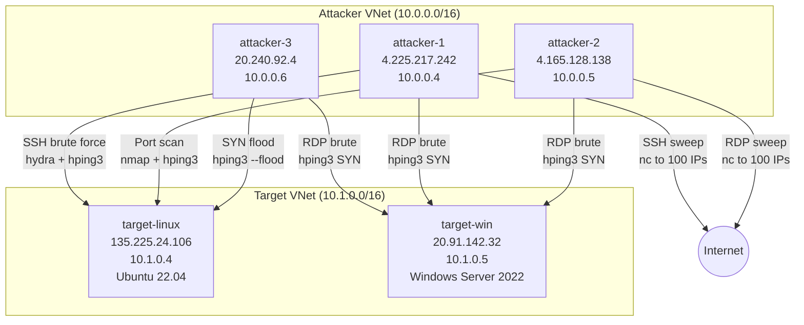

# Azure Defender for Cloud — Network Layer Alert Testing Lab

> Ephemeral Azure lab to simulate and validate Microsoft Defender for Cloud [network-layer security alerts](https://learn.microsoft.com/en-us/azure/defender-for-cloud/alerts-azure-network-layer).

## Executive Summary

This lab deploys attacker and target VMs in Azure to systematically trigger Defender for Cloud network-layer alerts. We executed **8 attack scenarios** covering SSH/RDP brute force, port scanning, outgoing sweeps, and DDoS simulation.

### Key Findings

| Detection Layer | Alerts Triggered | Detection Time | Notes |
|---|---|---|---|
| **MDE Endpoint** (Defender for Endpoint) | ✅ 6 alerts | ~15 min | "Unusual number of failed sign-in attempts" — SSH brute force detected at OS level |
| **Network Layer** (traffic sampling) | ⏳ Pending | 1–4 hours | Network-layer alerts use Azure traffic flow sampling; detection is probabilistic |

> **Insight:** MDE endpoint detection is significantly faster than network-layer detection. Brute force attempts are caught within minutes at the OS level via `sshd` log analysis, while network-layer alerts require traffic sampling and can take hours.

## Lab Topology



| Resource | Type | SKU | IP (Public) | IP (Private) |
|---|---|---|---|---|
| attacker-1 | Linux VM | Standard_B2als_v2 | 4.225.217.242 | 10.0.0.4 |
| attacker-2 | Linux VM | Standard_B2als_v2 | 4.165.128.138 | 10.0.0.5 |
| attacker-3 | Linux VM | Standard_B2als_v2 | 20.240.92.4 | 10.0.0.6 |
| target-linux | Linux VM | Standard_B2ats_v2 | 135.225.24.106 | 10.1.0.4 |
| target-win | Windows VM | Standard_B2als_v2 | 20.91.142.32 | 10.1.0.5 |

**Region:** swedencentral  
**Resource Group:** `lab-defender-alerts-20260429-091910`  
**Defender Plan:** Servers P2 (pre-enabled on subscription)

## Alert Classification

We classified all 16 documented network-layer alerts by simulation difficulty:

### 🟢 Easy — Incoming Brute Force (6 alerts)

These require only volumetric login traffic from attacker → target.

| Alert ID | Alert Name | Simulation Strategy |
|---|---|---|
| `SSH_Incoming_BF_OneToOne` | SSH brute force (single source) | hydra SSH from 1 attacker |
| `SSH_Incoming_BF_ManyToOne` | SSH brute force (multiple sources) | hydra SSH from 3 attackers |
| `RDP_Incoming_BF_OneToOne` | RDP brute force (single source) | hping3 SYN to port 3389 |
| `RDP_Incoming_BF_ManyToOne` | RDP brute force (multiple sources) | hping3 SYN from 3 attackers |
| `SQL_Incoming_BF_OneToOne` | SQL brute force (single source) | Deferred (no SQL Server deployed) |
| `Generic_Incoming_BF_OneToOne` | Generic brute force (single source) | Deferred (FTP/Telnet setup needed) |

### 🟡 Medium — Scanning & Outgoing (6 alerts)

These require outbound traffic patterns or specific scanning behaviors.

| Alert ID | Alert Name | Simulation Strategy |
|---|---|---|
| `PortScanning` | Port scanning detected | nmap full port scan (1-65535) |
| `DDOS` | DDoS attack detected | hping3 SYN flood (~2.2M packets) |
| `SSH_Outgoing_BF_OneToOne` | Outgoing SSH traffic | nc connections to 100 random IPs:22 |
| `SSH_Outgoing_BF_OneToMany` | Outgoing SSH sweep | nc connections to 100 random IPs:22 |
| `RDP_Outgoing_BF_OneToOne` | Outgoing RDP traffic | nc connections to 100 random IPs:3389 |
| `RDP_Outgoing_BF_OneToMany` | Outgoing RDP sweep | nc connections to 100 random IPs:3389 |

### 🔴 Hard — C2 & Malware (4 alerts)

These require malware-like behavior or known-bad IP communication. **Not tested** (unsafe).

| Alert ID | Alert Name | Why Hard |
|---|---|---|
| `Network_TrafficFromUnrecommendedIP` | Suspicious incoming traffic | Requires known-malicious source IP |
| `CnC.MalwareCommand` | C2 communication | Requires contacting actual C2 infrastructure |
| `W32.Conficker` | Conficker worm activity | Requires worm propagation patterns |
| `Network_CryptoMiningActivity` | Crypto mining network patterns | Requires mining pool traffic patterns |

## Attack Scenarios Executed

### Scenario 1: SSH Brute Force 1-to-1

**Attacker:** attacker-1 → **Target:** target-linux (port 22)  
**Tool:** `hydra -L userlist.txt -P wordlist.txt ssh://target -t 4`  
**Volume:** ~300 login attempts (10 users × 30 passwords)  
**Target Alert:** `SSH_Incoming_BF_OneToOne`

```
[DATA] attacking ssh://135.225.24.106:22/
[ATTEMPT] target 135.225.24.106 - login "root" - pass "password" - 1 of 300 [child 0] ...
[ATTEMPT] target 135.225.24.106 - login "root" - pass "123456" - 2 of 300 [child 1] ...
...
[STATUS] 300 tries, 0 success
```

### Scenario 2: SSH Brute Force Many-to-1

**Attackers:** attacker-1, attacker-2, attacker-3 → **Target:** target-linux  
**Volume:** ~900 total login attempts from 3 different source IPs  
**Target Alert:** `SSH_Incoming_BF_ManyToOne`

### Scenario 3: RDP Brute Force 1-to-1

**Attacker:** attacker-3 → **Target:** target-win (port 3389)  
**Tool:** `hping3 -S -p 3389 -c 500 --fast target`  
**Volume:** 500 SYN packets  
**Target Alert:** `RDP_Incoming_BF_OneToOne`

> **Note:** Application-layer RDP brute force tools (hydra, ncrack) failed on headless VMs — freerdp requires a display. We used SYN flood instead since network-layer alerts detect traffic patterns, not authentication attempts.

### Scenario 4: RDP Brute Force Many-to-1

**Attackers:** attacker-1, attacker-2 + attacker-3 → **Target:** target-win  
**Volume:** 300 SYN packets each from 3 sources  
**Target Alert:** `RDP_Incoming_BF_ManyToOne`

### Scenario 5: Port Scanning

**Attacker:** attacker-2 → **Target:** target-linux  
**Tool:** `nmap -Pn -sT -p 1-10000 target` (round 1), `nmap -Pn -sT -p 1-65535 --min-rate 2000 target` (round 2)  
**Target Alert:** `PortScanning`

```
PORT   STATE    SERVICE
22/tcp open     ssh
80/tcp filtered http
All 10000 scanned ports: 1 open, 1 filtered, 9998 closed
```

### Scenario 6: Outgoing SSH Sweep

**Attacker:** attacker-1 → **Targets:** 100 random public IPs on port 22  
**Tool:** `nc -w 2 -z <random_ip> 22` in a loop  
**Target Alert:** `SSH_Outgoing_BF_OneToMany`

### Scenario 7: Outgoing RDP Sweep

**Attacker:** attacker-2 → **Targets:** 100 random public IPs on port 3389  
**Tool:** `nc -w 2 -z <random_ip> 3389` in a loop  
**Target Alert:** `RDP_Outgoing_BF_OneToMany`

### Scenario 8: DDoS Simulation

**Attacker:** attacker-3 → **Target:** target-linux  
**Tool:** `hping3 -S -p 80 --flood target`  
**Volume:** ~2.2 million SYN packets in 30 seconds  
**Target Alert:** `DDOS`

```
--- 135.225.24.106 hping statistic ---
2238172 packets transmitted, 0 packets received, 100% packet loss
```

## Alerts Detected

### MDE Endpoint Alerts (detected within ~15 minutes)

6 alerts of type `VM.MDATP_32bb6594-fac7-49f8-9c6f-aa633b1c7326` — **"Unusual number of failed sign-in attempts"**

These were triggered by the SSH brute force scenarios. MDE detected the failed `sshd` login attempts at the operating system level.

| Alert | Severity | Entity | MITRE Tactic | Product |
|---|---|---|---|---|
| Unusual number of failed sign-in attempts | Medium | target-linux | CredentialAccess | Microsoft Defender ATP |
| Unusual number of failed sign-in attempts | Medium | target-linux | CredentialAccess | Microsoft Defender ATP |
| Unusual number of failed sign-in attempts | Medium | target-linux | CredentialAccess | Microsoft Defender ATP |
| Unusual number of failed sign-in attempts | Medium | target-linux | CredentialAccess | Microsoft Defender ATP |
| Unusual number of failed sign-in attempts | Medium | target-linux | CredentialAccess | Microsoft Defender ATP |
| Unusual number of failed sign-in attempts | Medium | target-linux | CredentialAccess | Microsoft Defender ATP |

<details>
<summary>Sample alert JSON</summary>

```json
{
  "alertDisplayName": "Unusual number of failed sign-in attempts",
  "alertType": "VM.MDATP_32bb6594-fac7-49f8-9c6f-aa633b1c7326",
  "severity": "Medium",
  "intent": "CredentialAccess",
  "compromisedEntity": "target-linux",
  "description": "A relatively high number of failed sign-in attempts were observed during a short period. This activity can indicate an attempt to brute-force credentials.",
  "productName": "Microsoft Defender ATP",
  "productComponentName": "Servers",
  "vendorName": "Microsoft",
  "status": "Active"
}
```

</details>

### Network Layer Alerts (pending — 1-4 hour delay)

Network-layer alerts are based on Azure's network traffic flow sampling. This is a **probabilistic** detection mechanism — not every attack will necessarily trigger an alert. Detection depends on:

1. **Sampling rate** — Azure samples a fraction of network flows; low-volume attacks may be missed
2. **Detection window** — alerts are generated after aggregation periods of 1-4 hours
3. **Baseline learning** — new VMs have no baseline, which affects anomaly detection

We ran two rounds of attacks to maximize detection probability. Results will be updated as alerts appear.

## Lessons Learned

### 1. MDE vs Network-Layer Detection

The most important finding is the **detection speed difference**:

- **MDE Endpoint Detection:** ~15 minutes for brute force detection (analyzes OS-level `sshd` authentication logs)
- **Network Layer Detection:** 1-4 hours (relies on traffic flow sampling at the Azure network fabric level)

For production environments, having **both layers enabled** provides defense in depth — fast endpoint detection plus network-level visibility for traffic that doesn't reach the OS.

### 2. Attack Tooling Challenges

| Tool | Protocol | Result |
|---|---|---|
| **hydra** (SSH) | SSH | ✅ Works perfectly — generates realistic brute force traffic |
| **hydra** (RDP) | RDP | ❌ Fails on headless VMs — requires freerdp display initialization |
| **ncrack** (RDP) | RDP | ❌ Extremely slow — 20+ min for handful of attempts |
| **hping3** (SYN) | TCP | ✅ Best for volumetric traffic — generates millions of packets |
| **nmap** | TCP | ✅ Works with `-Pn -sT` flags (skip ICMP discovery, use TCP connect) |
| **nc** (netcat) | TCP | ✅ Simple and reliable for outgoing sweep simulation |

### 3. Azure VM Operational Quirks

- **B1s/B2s SKUs unavailable** in swedencentral — had to use B2als_v2/B2ats_v2
- **SSH password auth disabled** by default on Azure Ubuntu VMs via cloud-init drop-in configs
- **Only one `run-command`** per VM at a time (HTTP 409 on concurrent invocations)
- **NSG batch creation** can silently drop rules — always verify after creation
- **`run-command` + `systemctl restart sshd`** can corrupt the session — use `reload` instead

### 4. Network-Layer Alert Design Implications

For security teams designing detection:
- Network-layer alerts are **not real-time** — plan for 1-4 hour detection latency
- **Sampling-based detection** is probabilistic — low-volume attacks may evade detection
- **MDE provides faster detection** for attacks that reach the OS (brute force, exploitation)
- **Network-layer adds value** for traffic patterns that don't generate OS events (DDoS, port scanning from external sources, C2 beaconing)

## Reproduction Steps

### Prerequisites

- Azure subscription with Defender for Servers P2 enabled
- Azure CLI installed and authenticated
- `gh` CLI for GitHub repo creation

### Deploy

```bash
# Create resource group
az group create -n my-defender-lab -l swedencentral

# Create VNets
az network vnet create -g my-defender-lab -n attacker-vnet --address-prefixes 10.0.0.0/16 --subnet-name default --subnet-prefixes 10.0.0.0/24
az network vnet create -g my-defender-lab -n target-vnet --address-prefixes 10.1.0.0/16 --subnet-name default --subnet-prefixes 10.1.0.0/24

# Create NSGs with attack-friendly rules
az network nsg create -g my-defender-lab -n attacker-nsg
az network nsg create -g my-defender-lab -n target-linux-nsg
az network nsg create -g my-defender-lab -n target-win-nsg
az network nsg rule create -g my-defender-lab --nsg-name target-linux-nsg -n AllowSSH --priority 100 --destination-port-ranges 22 --access Allow --protocol Tcp
az network nsg rule create -g my-defender-lab --nsg-name target-win-nsg -n AllowRDP --priority 100 --destination-port-ranges 3389 --access Allow --protocol Tcp

# Deploy attacker VMs (with cloud-init for security tools)
az vm create -g my-defender-lab -n attacker-1 --image Ubuntu2204 --size Standard_B2als_v2 \
  --vnet-name attacker-vnet --subnet default --nsg attacker-nsg \
  --custom-data cloud-init-attacker.yaml --generate-ssh-keys --admin-username azurelabuser

# Deploy target VMs
az vm create -g my-defender-lab -n target-linux --image Ubuntu2204 --size Standard_B2ats_v2 \
  --vnet-name target-vnet --subnet default --nsg target-linux-nsg \
  --generate-ssh-keys --admin-username azurelabuser

az vm create -g my-defender-lab -n target-win --image Win2022Datacenter --size Standard_B2als_v2 \
  --vnet-name target-vnet --subnet default --nsg target-win-nsg \
  --admin-username azurelabuser --admin-password 'YourP@ssw0rd!'
```

### Run Attacks

```bash
# SSH brute force
az vm run-command invoke -g my-defender-lab -n attacker-1 --command-id RunShellScript \
  --scripts "hydra -L /opt/attacker/userlist.txt -P /opt/attacker/wordlist.txt ssh://TARGET_IP -t 4"

# Port scan
az vm run-command invoke -g my-defender-lab -n attacker-2 --command-id RunShellScript \
  --scripts "nmap -Pn -sT -p 1-65535 --min-rate 2000 TARGET_IP"

# DDoS simulation
az vm run-command invoke -g my-defender-lab -n attacker-3 --command-id RunShellScript \
  --scripts "timeout 30 hping3 -S -p 80 --flood TARGET_IP"

# Outgoing sweep
az vm run-command invoke -g my-defender-lab -n attacker-1 --command-id RunShellScript \
  --scripts "/opt/attacker/outgoing-ssh-sweep.sh TARGET_IP"
```

### Monitor Alerts

```bash
# Poll for alerts (repeat every 15-30 min for up to 4 hours)
az security alert list --resource-group my-defender-lab -o table
```

### Cleanup

```bash
az group delete -n my-defender-lab --yes --no-wait
```

## Attacker Cloud-Init

The attacker VMs are provisioned with a [cloud-init template](raw-output/cloud-init-attacker.yaml) that installs:

- **hydra** — SSH/FTP/HTTP brute force
- **nmap** — port scanning and service detection
- **hping3** — SYN flood and packet crafting
- **medusa** — parallel brute force
- **ncrack** — network auth cracker
- **sshpass** — scripted SSH with password
- **netcat** — TCP connection testing

Plus 7 attack scripts in `/opt/attacker/`:
- `ssh-brute.sh` — SSH brute force via hydra
- `rdp-brute.sh` — RDP brute force via hydra/ncrack
- `sql-brute.sh` — SQL brute force via hydra
- `port-scan.sh` — Full port scan via nmap
- `outgoing-ssh-sweep.sh` — SSH connections to random IPs
- `outgoing-rdp-sweep.sh` — RDP connections to random IPs
- `ddos-sim.sh` — SYN flood via hping3

## File Structure

```
├── README.md                          # This file
├── raw-output/
│   ├── 01-rg-create.json             # Resource group creation
│   ├── 02-defender-enable.json       # Defender for Cloud status
│   ├── 02b-sshd-fix.txt             # SSH password auth fix
│   ├── 03-ssh-brute-1to1.txt        # SSH brute force output
│   ├── 04-rdp-brute-1to1.txt        # RDP SYN flood output
│   ├── 05-port-scan.txt             # Port scan results
│   ├── 06-ssh-brute-manyto1.txt     # Multi-source SSH brute
│   ├── 07-outgoing-ssh-sweep.txt    # Outgoing SSH sweep
│   ├── 08-outgoing-rdp-sweep.txt    # Outgoing RDP sweep
│   ├── 09-rdp-brute-manyto1.txt     # Multi-source RDP brute
│   ├── 10-ddos-simulation.txt       # DDoS SYN flood
│   ├── 11-alerts-poll-1.json        # First alert poll
│   └── 12-alerts-poll-2.json        # Second alert poll
├── screenshots/                       # Portal screenshots
└── diagrams/                         # Architecture diagrams
```

## References

- [Defender for Cloud Network Layer Alerts](https://learn.microsoft.com/en-us/azure/defender-for-cloud/alerts-azure-network-layer)
- [Defender for Cloud Alert Schema](https://learn.microsoft.com/en-us/azure/defender-for-cloud/alerts-schemas)
- [Azure Network Watcher](https://learn.microsoft.com/en-us/azure/network-watcher/)
- [Hydra - Network Logon Cracker](https://github.com/vanhauser-thc/thc-hydra)
- [Nmap - Network Scanner](https://nmap.org/)
- [Hping3 - Packet Crafter](http://www.hping.org/)

---

*Lab created on 2026-04-29 using the [azure-lab](https://github.com/erjosito/copilot-azure-lab) Copilot skill.*
